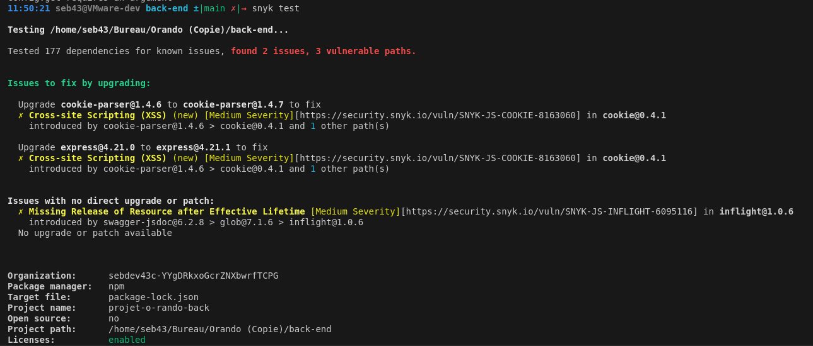
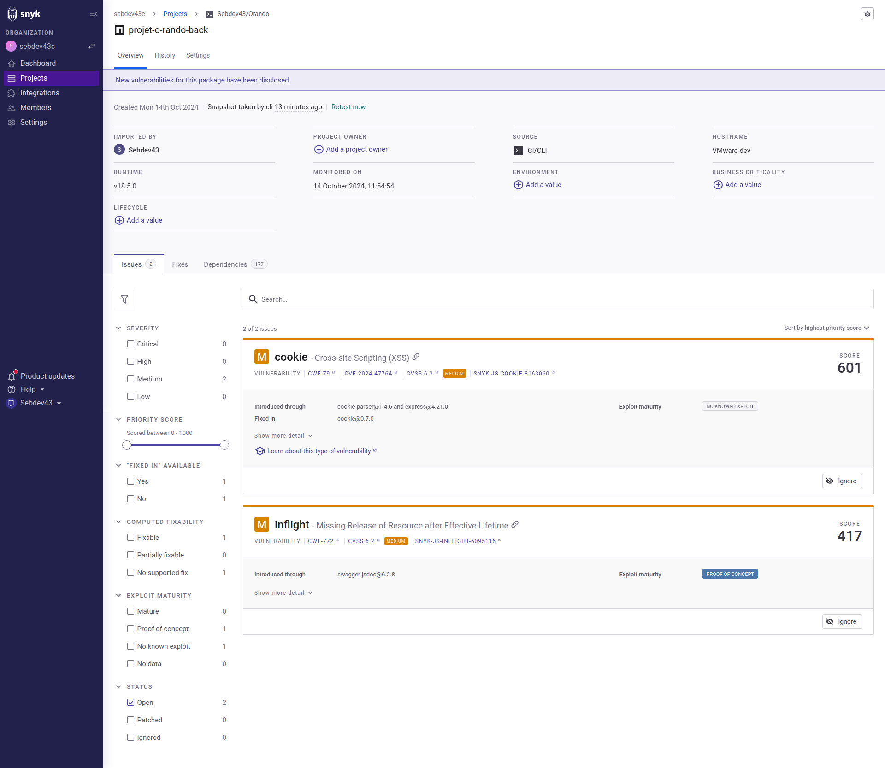
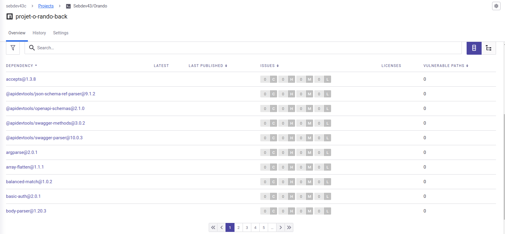

# La Configuration et l'Utilisation de Snyk

## Introduction

Snyk est un outil qui aide à identifier et à corriger les vulnérabilités de sécurité dans les dépendances des projets logiciels. Ce README vous guide dans la configuration de Snyk et son utilisation pour surveiller vos projets.

## Prérequis

Avant de commencer, assurez-vous d'avoir :

- Un compte Snyk. Inscrivez-vous sur [Snyk](https://snyk.io/) si vous n'en avez pas.
- Node.js et npm installés sur votre machine.

## Installation de Snyk CLI

Pour installer Snyk CLI, exécutez la commande suivante dans votre terminal :

```bash
npm install -g snyk
```

## Authentification avec Snyk

Après avoir installé Snyk CLI, vous devez vous authentifier. Exécutez la commande suivante :

```bash
snyk auth
```

Cette commande ouvrira une page Web dans votre navigateur. Connectez-vous à votre compte Snyk. Une fois l'authentification terminée, vous serez prêt à utiliser Snyk.

## Surveillance d'un Projet

Pour surveiller votre projet, accédez au répertoire de votre projet dans le terminal. Ensuite, exécutez la commande suivante :

```bash
snyk monitor --all-projects --org=<YOUR_ORG_ID>
```

Remplacez `<YOUR_ORG_ID>` par l'ID de votre organisation Snyk. Cette commande créera un instantané de votre projet et le stockera dans Snyk pour une analyse continue.

## Analyse des Vulnérabilités

Pour analyser votre projet à la recherche de vulnérabilités, utilisez la commande suivante :

```bash
snyk test
```

Cela effectuera une analyse de votre projet et affichera un rapport sur les vulnérabilités détectées.

## Notifications

Snyk vous enverra des notifications par e-mail concernant tout problème de sécurité nouvellement divulgué lié aux dépendances de votre projet. Assurez-vous que vos paramètres de notification sont correctement configurés dans votre compte Snyk.

## Affichage du rendu test en cli



## Affiche du résultat sur l'interface web




## Conclusion

Snyk est un outil puissant qui permet de suivre efficacement les dépendances d'un projet. Ici, je n'ai testé que la partie npm, mais Snyk propose bien plus de fonctionnalités. J'utilise actuellement la version gratuite.

Snyk offre plusieurs méthodes d'installation, notamment via un exécutable (.exe), npm, Homebrew (pour macOS) et Scoop (pour Windows), ce qui le rend accessible sur différentes plateformes et selon les préférences de l'utilisateur.
